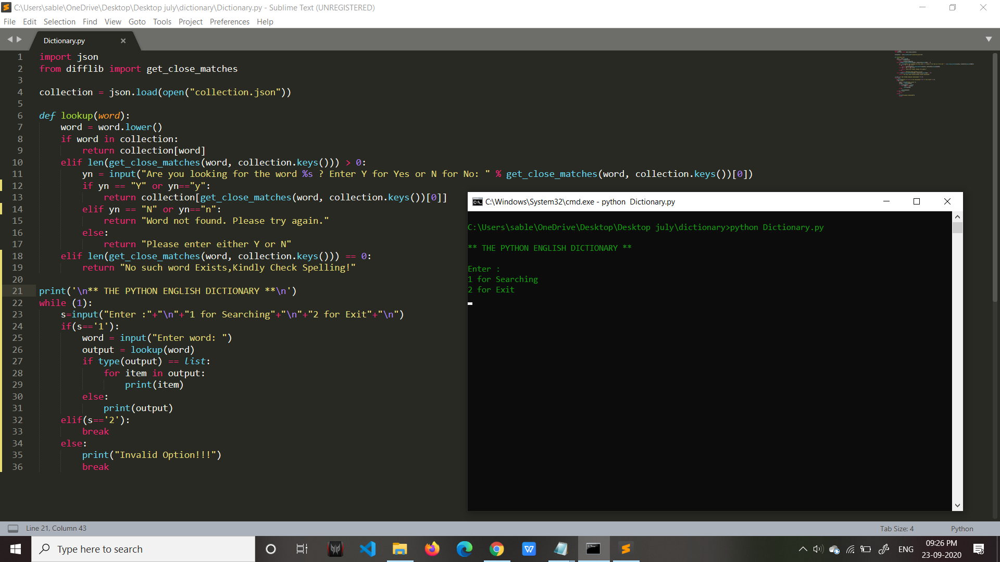
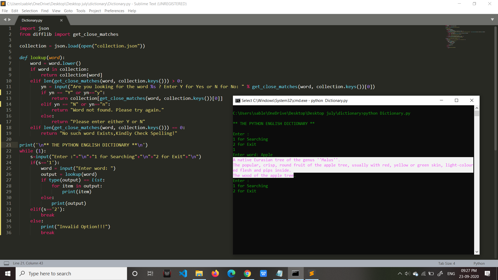
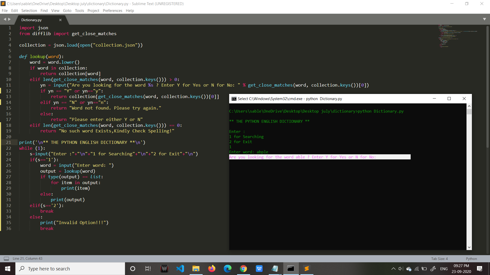

# Dictionary
A Python program to create simple word search using JSON file.

<h2>Important libraries to be imported:</h2>
1) <strong>json:</strong>
    json exposes an API familiar to users of the standard library marshal and pickle modules.
2)<strong>difflib:</strong>
    This module provides classes and functions for comparing sequences.

<h3>the code is self explainatory..just give it a read :)<h3/>

#following screenshots may help...
<h2>First Run:</h2>

 
<h2>When word entered is correct and available in json file:</h2>

 
<h2>When you misspelled the word:</h2>

 

<h1> Happy Coding!!:)</h1>
